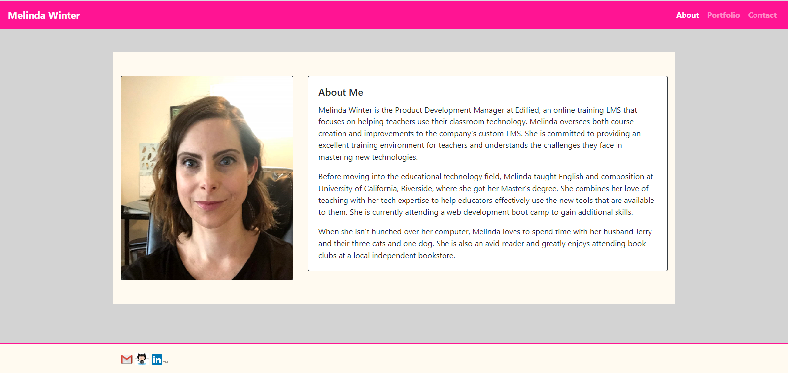
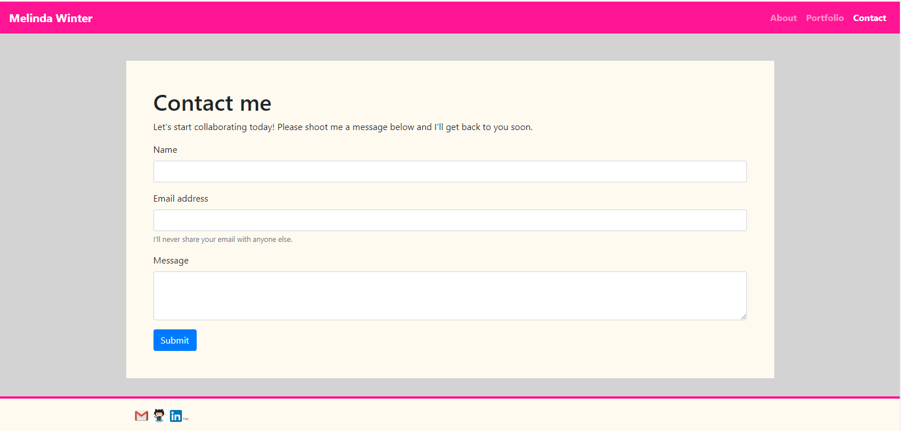

# My Professional Portfolio

## Description

This is a website intended to host my professional information and contact details. It is designed to be responsive and look great on big and small screens. This is a long-term project that I will continue to build and refine, so some of the elements are currently place holders. The site does currently have working navigation links that let users easier travel between the About, Portfolio, and Contact pages. There are also links in the footer that will allow visitors to easily email me or see my LinkedIn and GitHub profiles. Below are screenshots of each page.

## Usage

This is a site that I hope will be visited by other people in my professional fields and potential new employers or collaborators. It can be used to give people a clearer idea of what I can offer them or their business. The contact page will help visitors quickly and easily reach out to me.

https://blog.hootsuite.com/social-media-icons/
W3 School and Codecademy
https://www.themuse.com/advice/the-35-best-personal-websites-weve-ever-seen

https://offers.hubspot.com/thank-you/personal-brand-professional-bio-examples?hubs_post-cta=interactive
