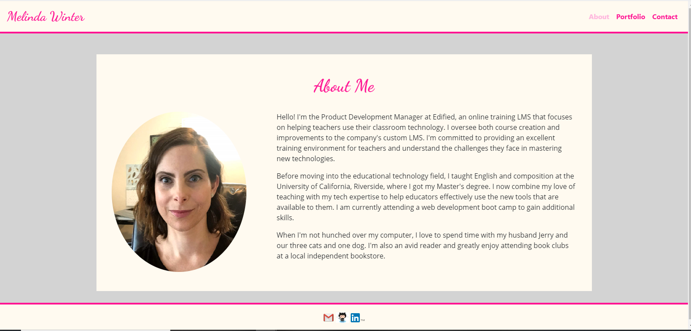
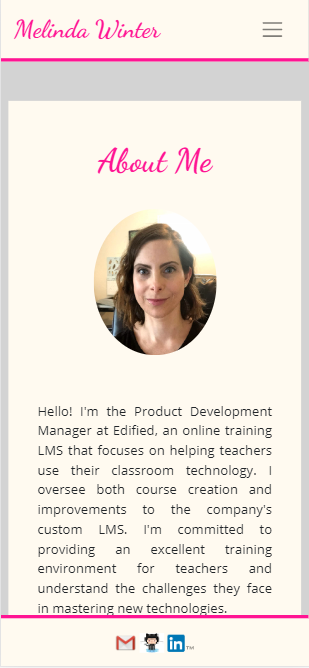

# My Professional Portfolio

## Description

<https://melindawinter.github.io/portfolio/index.html>

This is a website intended to host my professional information and contact details. It is designed to be responsive and look great on big and small screens. This is a long-term project that I will continue to build and refine. The site has working navigation links that let users easier travel between the About, Portfolio, and Contact pages. There are also links in the footer that will allow visitors to easily email me or see my LinkedIn and GitHub profiles.

## Usage

This is a site that I hope will be visited by other people in my professional field and potential new employers or collaborators. It can be used to give people a clearer idea of what I can offer them or their business. The contact page will help visitors quickly and easily reach out to me.

## Credits

A thank you to the boot camp cohort for being there via Slack during the creation process. Thank you to Adam Abundis for all the great resources and for helpful suggestions when I was stuck and to Thor Nolan, my very patient tutor.

I also sought out many web resources for this project. I used W3 Schools, Codecademy, and the Bootstrap documentation pages throughout. I found some of the social media icons I needed here: <https://blog.hootsuite.com/social-media-icons/.> This site had some great style ideas for personal websites: <https://www.themuse.com/advice/the-35-best-personal-websites-weve-ever-seen.> I found writing the bio challenging and this site was extremely helpful: <https://offers.hubspot.com/thank-you/personal-brand-professional-bio-examples?hubs_post-cta=interactive.>

## License

I chose a permissive GNU license for this project, so that others can use and modify the code for their own purposes, but the source code cannot become proprietary and changes must be documented. The file name is COPYING as per GNU convention.
